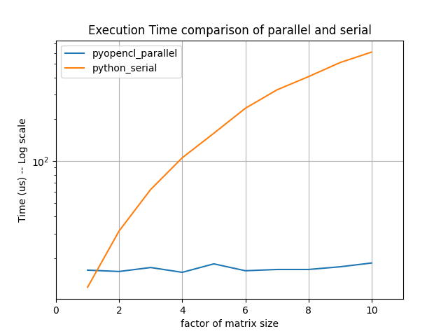
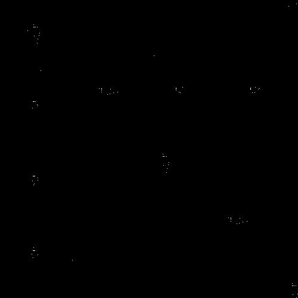
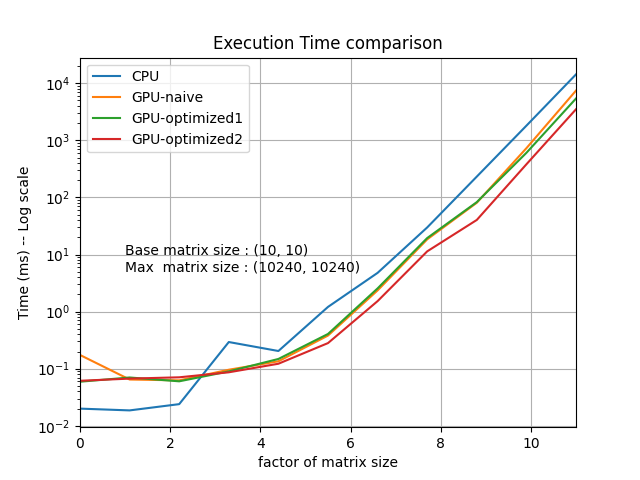
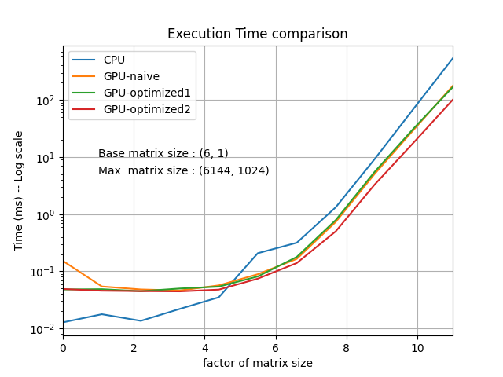
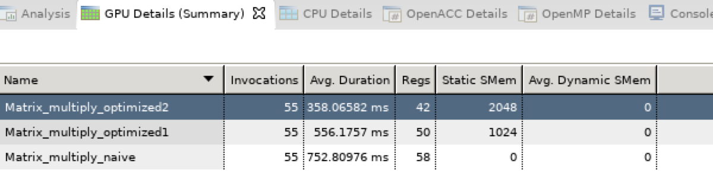
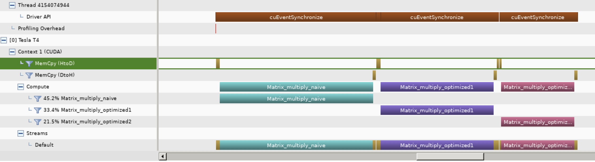
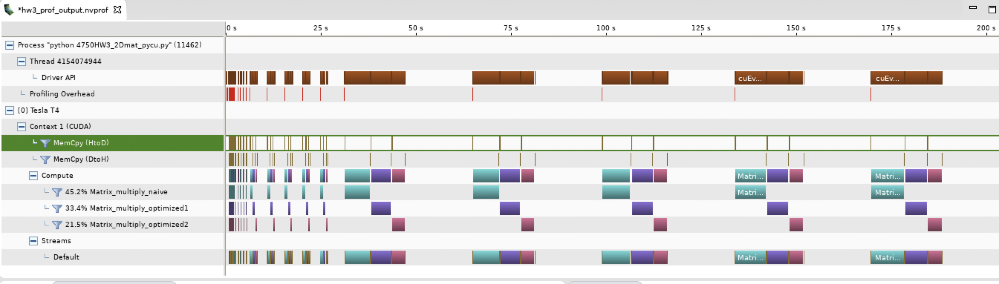

# EECS E4750: Assignment-3 Report, Fall 2020

## Submission Details

**UNI:** *pl2748*

**GitHub ID:** *pei2748*

**Date of Last Commit:** *11-01-2020*

**No. of hours devoted to assignment:** *48* hours

## Assignment Overview

Write 2 or 3 sentences here, summarizing what are the key points of this assignment, from your point of view. You may speculate on the importance of the key concept, or comment on similarities and differences with previous assignments. 

## Task-1: PyOpenCL

Matrix tranpose operated on GPU in parallel can reduce execution time. Since no data reuse in this algorithm, so there is no space for memory optimization. Use a 2D diagram, get_global_id(0) and get_global_id(1) can retrive the thread index in each dimension. Matrix transpose is to swap the index of column and row. I used pyopencl.array to transfer data between GPU and Host.

The execution time comparison is shown as below. I collected the time by averaging among 5 runs. The base matrix size is randomly generated. For the figure below, the base matrix size is (2, 5). The *x* axis is the factor of the base matrix size, for example, x = 2 means matrix size is (4, 10). I iteratively increase matrix size unitl (10*2, 10*5). We can see that the execution time for matrix transpose operation on CPU is increaing over the matrix size. But it keeps the same for GPU running with pyopencl code. Because each thread only computes one ouput element, and all threads work in parallel.

Image blending has two matrix operation: matrix transpose and matrix addition. Both are treated as a 2D problem. The size of the input image is (500, 500, 3). It firstly is converted to a grayscale image, which has size (500, 500). I generate a random floating point number between 0 to 1 as alpha. After transpose image_1 and then do the image blending with image_2, the output image could be converted back to a RGB image by Image.convert('RGB').  The output images look different when using different alpha. Since how image blending works is not our focus. I only put the output image wiht alpha as 0.2 here. It is shown below.

## Task-2: PyCUDA

For the CPU execution time, I collect the time from running numpy.matmul() function. For the naive matrix multiplication, no tiling. But the block size and grid size have relationship with the tile width. This should not impact the execution time of the naive algorithm. For optimization 1, we only store matrix B into shared memory. While for optimization 2, we store both A and B tiles into shared memory. I generated a random-sized matrix by generating 2 random number between 1 to 10. One is height and the other is width. Then I iteratively increase the matrix size by multipling height and width with 2^p with p ranging from 0 to 10. So the maximum possible height and width is 1024 * 10 = 10240. For this assignment, I define the tile width as 16. 

Below is the running results of 4 computing method. When the matrix size is small, numpy has smaller execution time since running pycuda on GPU needs to launch context, which is the overhead. But when matrix size is large, Running on GPU is faster since running in parallel. Loading matrix tile into shared memory can reduce executing time since it reduces memory traffic. The first figure has base matrix size as (6,1), the second figure has base matrix size as (10,10). Base matrix sizes are randomly generated.

The nvvc profiling also supports the results. We can see that the executing time of optimization 2 is the shortest while the naive method is the longest. The "GPU details (summary)" shows that optimized2 kernel used 2048 shared memory space while optimized1 used 1024 shared memory space. 

We can see that the optimized2 kernel has the shoretest execution time.

Since I average the execution time in 5 runs, we can see that the 3 kernels are invoked for 5 times.

## Theory Questions

Write your answers to the theory questions here. Don't forget to include the questions for completeness. 

1. (2 points)   For our tiled matrix-matrix multiplication kernel, if we use a 32X32 tile, what is the reduction of memory bandwidth usage for input matrices A and B?

*Answer:* c. 1/32 of the original usage. Since the 1024 threads loading one element from A and one element from B has 1024 *2 memory traffic. But it has 1024 * (32 * 2) mul/add computation. So the memory traffic is reduced by 32 times.

2. (2 points)   For the tiled single-precision matrix multiplication kernel as shown in one of the lectures, assume that the tile size is 32X32 and the system has a DRAM burst size of 128 bytes. How many DRAM bursts will be delivered to the processor as a result of loading one A-matrix tile by a thread block?

*Answer*: b. 32. single-precision floating point data takes 4 bytes. One A-matrix tile has 1024 * 4 bytes data. So the bursts needed is (1024 * 4) / 128 = 32

3. (3 points)_  For a vector addition, assume that the vector length is 8000, each thread calculates one output element, and the thread block size is 1024 threads. The programmer configures the kernel launch to have a minimal number of thread blocks to cover all output elements. How many threads will be in the grid?

*Answer*:  8 blocks will have 8192 threads. So 8192 threads will be in the grid.

4. (5 points)_  What is a warp in CUDA? 

A warp in CUDA is a hardware concept which has 32 threads. All threads in one warp execute the same instruction. There are some hardware design for a warp to make the communication within a warp much fast than communications between threads in different warps. Thread blocks are formed by warps. So it is better to keep the size of a thread block to be a multiple of 32.

5. (3 points)_  How does the term  _local memory_  differ for CUDA and OpenCL? What is the CUDA analog to OpenCL's local memory? How is it different from CUDA's local memory?

In CUDA, the memory shared by one thread block is called shared memory while in openCL it is called local memory. This memory is used by one block. All threads within the same block can access this memory. In CUDA,  local momory refers to the memory for each thread. And it is called private memory in openCL.

## References

1. [Lecture Slides - 1.8.HC.BasicMatrix-MatrixMultiplication.20201001]

2. [Lecture slides - 2.5.HC.TiledMatrixMultiplication.20201007]

3. [PyOpencl matrix multiplication](https://github.com/stefanv/PyOpenCL)
 
4. [Stackoverflow](https://stackoverflow.com/questions/18815489/cuda-tiled-matrix-matrix-multiplication-with-shared-memory-and-matrix-size-whic)